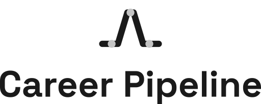

  

  <picture>
    <source media="(prefers-color-scheme: dark)" srcset="assets/lockups/lockup-stacked-paper.svg">
    
  </picture>

 

---

Job-search workspace used with the **career-pipeline** plugin (skills + rules live on the plugin, not in this folder).

---

 

## Quick start

1. Install the **career-pipeline** plugin (see parent README)
2. Prefer creating this folder via `/career-pipeline-init` into an **empty** directory
3. Copy [`.career-pipeline.yml.example`](.career-pipeline.yml.example) → `.career-pipeline.yml` and replace the Jordan Hale example with your details
4. Build resume and cover letter HTML from a pair under `design/samples/` (see getting started)
5. Use `/career-pipeline-analyze-job` with a posting URL, or source leads first

Walkthrough: [docs/getting-started.md](docs/getting-started.md). Skill catalog: [docs/skills.md](docs/skills.md).

## Skills (summary)

| Group | Invoke |
|-------|--------|
| Setup | `/career-pipeline-init` |
| Lead Discovery | `/career-pipeline-source-leads`, `/career-pipeline-archive-lead` |
| Application | `/career-pipeline-analyze-job`, `/career-pipeline-create-application`, `/career-pipeline-create-interview-prep`, `/career-pipeline-analyze-offer`, `/career-pipeline-archive-submission`, `/career-pipeline-delete-submission` |

The `career-pipeline-` prefix is intentional for `/` popup discoverability. Details: [docs/skills.md](docs/skills.md).

## Docs

- [docs/getting-started.md](docs/getting-started.md) — Persona YAML + resume HTML pre-work
- [docs/skills.md](docs/skills.md) — Full skill tables and entrypoints
- [docs/customization.md](docs/customization.md) — YAML profile checklist
- [docs/tooling.md](docs/tooling.md) — Optional Chrome headless PDF + `pdfunite`
- [design/README.md](design/README.md) — Sample templates

See the parent [career-pipeline README](../README.md) for plugin install and manual alternatives.

 

---

 

<picture>
  <source media="(prefers-color-scheme: dark)" srcset="assets/lockups/lockup-horizontal-paper.svg">
  
</picture>

your personal career agent for every milestone

 
